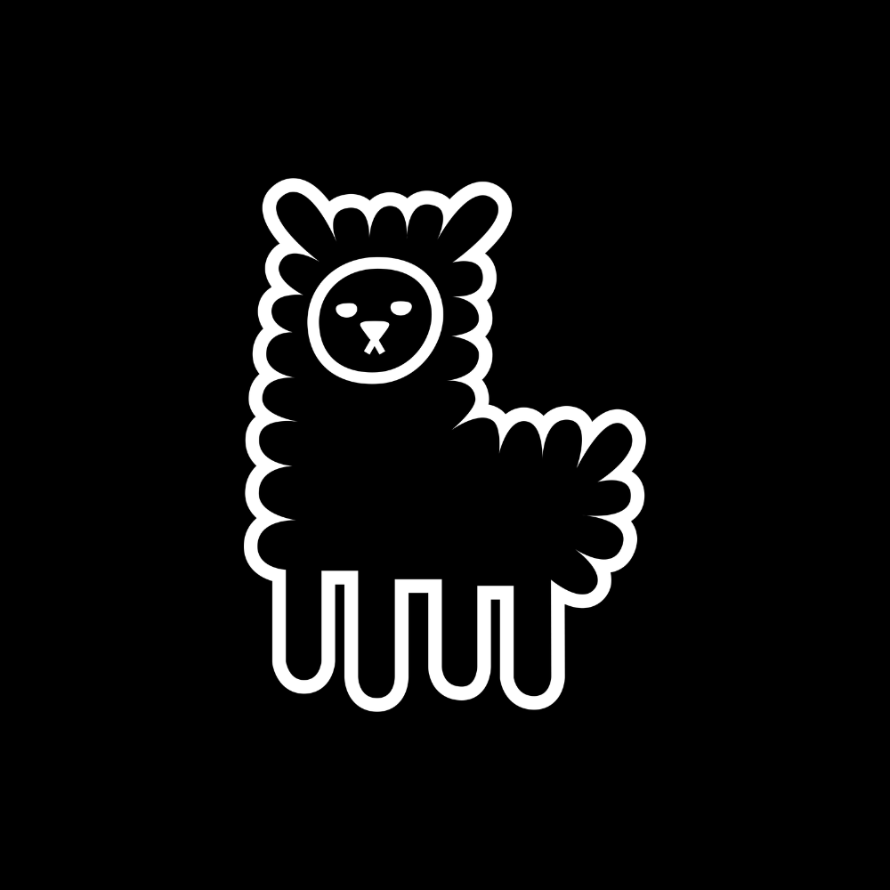

<p align="center">
  
</p>

<h1 align="center">ytdlp2tg</h1>

<p align="center">
  Telegram bot that downloads videos from 1000+ platforms and delivers them directly to your chat.
</p>

<p align="center">
  <a href="https://github.com/seminarioA/ytdlp2tg/actions/workflows/ci.yml"></a>
  <a href="https://github.com/seminarioA/ytdlp2tg/pkgs/container/ytdlp2tg"></a>
  <a href="https://t.me/ytdlp_x7bot"></a>
  <a href="LICENSE"></a>
</p>

---

## Overview

**ytdlp2tg** bridges [yt-dlp](https://github.com/yt-dlp/yt-dlp) with Telegram. Send any video URL — TikTok, YouTube, Instagram, Twitter/X, Reddit, and 1000+ more — and receive the video file directly in your chat, with metadata, quality selection, and real-time progress updates.

A local [Telegram Bot API server](https://github.com/tdlib/telegram-bot-api) runs alongside the bot, raising the file size limit from 50 MB to **2 GB**.

## Features

- **1000+ platforms** via yt-dlp (YouTube, TikTok, Instagram, Twitter/X, Reddit, Twitch, and more)
- **Quality selection** — 360p / 480p / 720p / 1080p / audio-only (skipped for TikTok, always max quality)
- **2 GB file limit** via local Telegram Bot API server
- **Real-time progress** — download and upload progress bars in the message
- **Rich metadata** — uploader, view count, likes, comments, reposts
- **TLS impersonation** via `curl_cffi` for platforms with strict bot detection

## Architecture

```
User ──► Telegram ──► ytdlp-bot ──► yt-dlp ──► [Platform]
                          │
                          └──► Local Telegram Bot API (2 GB limit)
                          └──► Dozzle (log viewer, :8080)
```

CI builds the `ytdlp-bot` image on GitHub Actions and pushes it to GHCR. The VPS pulls the pre-built image — no build step on the server.

## Quick Start

### Prerequisites

- Docker + Docker Compose
- A Telegram bot token from [@BotFather](https://t.me/BotFather)
- Telegram API credentials from [my.telegram.org](https://my.telegram.org)

### Deploy

```bash
git clone https://github.com/seminarioA/ytdlp2tg.git
cd ytdlp2tg

cp .env.example .env
# Fill in BOT_TOKEN, API_ID, API_HASH in .env

docker-compose pull
docker-compose up -d
```

### Dozzle (log viewer)

Generate credentials:

```bash
docker run --rm ghcr.io/seminarioa/ytdlp2tg generate <USERNAME> --password <PASSWORD>
```

Create `users.yml` with the output and restart Dozzle. Logs available at `http://<host>:8080`.

## Configuration

| Variable | Description |
|---|---|
| `BOT_TOKEN` | Telegram bot token from @BotFather |
| `API_ID` | Telegram API ID from my.telegram.org |
| `API_HASH` | Telegram API hash from my.telegram.org |

## CI / CD

Push to `main` triggers the GitHub Actions pipeline:

1. **Build** — builds the Docker image
2. **Push** — pushes `ghcr.io/seminarioa/ytdlp2tg:latest` and a `sha-*` tag
3. **Deploy** — SSHs into the VPS, pulls the new image, restarts the service

No builds happen on the VPS.

## Development

```bash
git clone https://github.com/seminarioA/ytdlp2tg.git
cd ytdlp2tg
pip install -r requirements.txt
BOT_TOKEN=<token> python bot.py
```

## Contributing

1. Fork the repository
2. Create a feature branch (`git checkout -b feat/my-feature`)
3. Commit your changes
4. Open a pull request

## License

MIT © [seminarioA](https://github.com/seminarioA)
